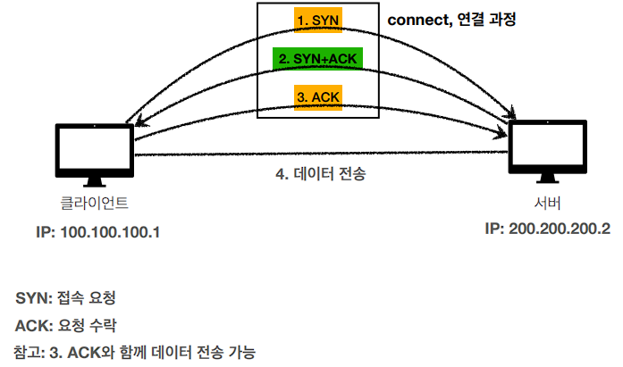

# #1 인터넷 네트워크

##  인터넷 통신
- 컴퓨터 간의 통신을 할 때 중간에 인터넷이 있다.
- 복잡한 인터넷 망을 어떤 규칙으로 어떻게 넘어가는가?
  
  
## IP(Internet Protocol)
- **인터넷 프로토콜 역할**
    - 지정한 IP 주소(IP Address)에 데이터 전달
    - 패킷(Packet)이라는 통신 단위로 데이터 전달
  

- **IP 패킷 정보**
    

    - 클라이언트 패킷 전달
     

    - 서버 패킷 전달
    

- **IP 프로토콜의 한계**
    - 비연결성
        - 패킷을 받을 대상이 없거나 서비스 불능 상태여도 패킷 전송
      
    - 비신뢰성
        - 중간에 패킷이 사라지면?
        - 패킷이 순서대로 안오면?
      
    - 프로그램 구분
        - 같은 IP를 사용하는 서버에서 통신하는 애플리케이션이 둘 이상이면?
  
  
## TCP, UDP

**인터넷 프로토콜 스택의 4계층**

  

- **프로토콜 계층**

    
      

- **TCP/IP 패킷 정보**

    
      

- **TCP 특징**
    - 전송 제어 프로토콜(Transmission Control Protocol)
  
    - 연결지향 - TCP 3 way handshake (가상 연결)
        
    - 데이터 전달 보증
        
    - 순서 보장
        
  
    - 신뢰할 수 있는 프로토콜
    - 현재는 대부분 TCP 사용
  
  

- **UDP 특징** <- 요즘 뜬다
    - 사용자 데이터그램 프로토콜(User Datagram Protocol)
      
    - 하얀 도화지에 비유(기능이 거의 없음)
    - 연결 지향 X - TCP 3 way handshake X
    - 데이터 전달 보증 X
    - 순서 보장 X
    - 데이터 전달 및 순서가 보장되지 않지만, 단순하고 빠름
    - 정리
        - IP와 거의 같다. +PORT +체크섬 정도만 추가
        - 애플리케이션에서 추가 작업 필요
  
  
## PORT

  
  
## DNS

