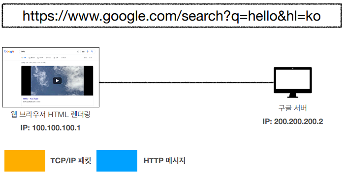

# #2 URI와 웹 브라우저 요청 흐름

## URI(Uniform Resource Identifier)
**"URI는 로케이터(locator), 이름(name) 또는 둘 다 추가로 분류될 수 있다."**
  
     
  
     
  

- **URI**
    - **U**niform: 리소스 식별하는 통일된 방식
    - **R**esource: 자원, URI로 식별할 수 있는 모든 것(제한 없음)
    - **I**dentifier: 다른 항목과 구분하는데 필요한 정보
  
    - URL(Uniform Resource Locator): 리소스가 있는 위치 저장
    - URN(Uniform REsource Name): 리소스에 이름 부여
    - 위치는 변할 수 있지만 이름은 변하지 않는다.
    - urn:isbn:8960777331 (어떤 책의 isbn URN)
    - URN 이름만으로 실제 리소스를 찾을 수 있는 방법이 보편화 되지 않음
    - **앞으로 URI를 URL과 같은 의미로 이야기하겠다.**
  
- **URL**
    - scheme://[userinfo@]host[:port][/path][?query][#fragment]
    - https://www.google.com:443/search?q=hello&hl=ko
      
    - 프로토콜(https)
    - 호스트명(www.google.com)
    - 포트번호(443)
    - 패스(/search)
    - 쿼리 파라미터(q=hello&hl=ko)
      
      
    - scheme
        - 주로 프로토콜 사용
        - 프로토콜: 어떤 방식으로 자원에 접근할 것인가 하는 약속 규칙
            - 예) http, https, ftp 등등
        - http는 80 포트, https는 443 포트를 주로 사용, 포트는 생략 가능
        - https는 http에 보안 추가 (HTTP Secure)
          
    - userinfo
        - URL에 사용자정보를 포함해서 인증
        - 거의 사용하지 않음
          
    - host
        - 호스트명
        - 도메인명 또는 IP 주소를 직접 사용가능
          
    - PORT
        - 포트(PORT)
        - 접속 포트
        - 일반적으로 생략, 생략시 http는 80, https는 443
          
    - path
        - 리소스 경로(path), 계층적 구조
        - 예)
            - /home/file1.jpg
            - /members
            - /members/100, /items/iphone12
          
    - query
        - key=value 형태
        - ?로 시작, &로 추가 가능 ?keyA=valueA&keyB=valueB
        - query parameter, query string 등으로 불림, 웹서버에 제공하는 파라미터, 문자 형태
          
    - fragment
        - html 내부 북마크 등에 사용
        - 서버에 전송하는 정보 아님
          
## 웹 브라우저 요청 흐름

- HTTP 요청 메시지 생성 
 

  

- HTTP 메서지 전송 

  

- 패킷 생성 
 

  

- 요청 패킷 전달 

  

- 요청 패킷 도착 
 

  

- 응답 패킷 전달 

  

- 응답 패킷 도착, 렌더링 
 

  