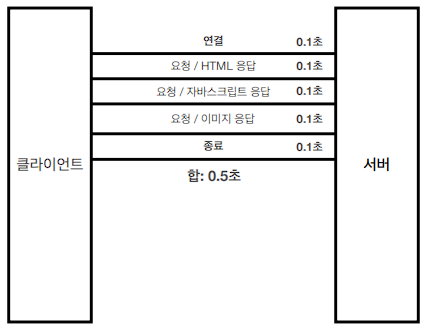

# #3 HTTP 기본

## 모든 것이 HTTP
- **HTTP(HyperText Transfer Protocol)**
    - HTTP 메시지에 모든 것을 전송
        - HTML, TEXT
        - IMAGE, 음성, 영상, 파일
        - JSON, XML (API)
        - 거의 모든 형태의 데이터 전송 가능
        - 서버간의 데이터를 주고 받을 때도 대부분 HTTP 사용
        <BR><BR>
    - **지금은 HTTP 시대!**
        <BR><BR>
- **HTTP 역사**
    - HTTP/0.9 1991년: GET 메서드만 지원, HTTP 헤더X
    - HTTP/1.0 1996년: 메서드, 헤더 추가
    - **HTTP/1.1 1997년: 가장 많이 사용, 우리에게 가장 중요한 버전**
        - RFC2068 (1997) -> RFC2616 (1999) -> RFC7230~7235 (2014)
    - HTTP/2 2015년: 성능 개선
    - HTTP/3 진행중: TCP 대신에 UDP 사용, 성능 개선
    <BR><BR>
- **기반 프로토콜**
    - **TCP**: HTTP/1.1, HTTP/2
    - **UDP**: HTTP/3
    - 현재 HTTP/1.1 주로 사용
        - HTTP/2, HTTP/3 도 점점 증가
<BR><BR>
- **HTTP 특징**
    - 클라이언트 서버 구조
    - 무상태 프로토콜(스테이스리스), 비연결성
    - HTTP 메서지
    - 단순함, 확장 기능
<BR><BR>
<BR><BR>
## 클라이언트 서버 구조
- Request Response 구조
- 클라이언트는 서버에 요청을 보내고, 응답을 대기
- 서버가 요청에 대한 결과를 만들어서 응답
<BR><BR>
    
<BR><BR>
<BR><BR>
## Stateful, Stateless
- **무상태 프로토콜**
<br>스테이스리스(Stateless)
    - 서버가 클라이언트의 상태를 보존X
    - 장점: 서버 확장성 높음(스케일 아웃)
    - 단점: 클라이언트가 추가 데이터 전송
<BR><BR>
- **Stateful, Stateless 차이**
    - 상태 유지 - Stateful
        ```
        • 고객: 이 노트북 얼마인가요?
        • 점원: 100만원 입니다.

        • 고객: 2개 구매하겠습니다.
        • 점원: 200만원 입니다. 신용카드, 현금중에 어떤 걸로 구매 하시겠어요?

        • 고객: 신용카드로 구매하겠습니다.
        • 점원: 200만원 결제 완료되었습니다.
        ```
        <BR><BR>
    - 상태 유지 - Stateful, 점원이 중간에 바뀌면?
        ```
        • 고객: 이 노트북 얼마인가요?
        • 점원A: 100만원 입니다.

        • 고객: 2개 구매하겠습니다.
        • 점원B: ? 무엇을 2개 구매하시겠어요?

        • 고객: 신용카드로 구매하겠습니다.
        • 점원C: ? 무슨 제품을 몇 개 신용카드로 구매하시겠어요?
        ```
        <BR><BR>
    - 상태 유지 - Stateful, 정리
        ```
        • 고객: 이 노트북 얼마인가요?
        • 점원: 100만원 입니다. (노트북 상태 유지) 

        • 고객: 2개 구매하겠습니다.
        • 점원: 200만원 입니다. 신용카드, 현금중에 어떤 걸로 구매 하시겠어요?
        (노트북, 2개 상태 유지) 

        • 고객: 신용카드로 구매하겠습니다.
        • 점원: 200만원 결제 완료되었습니다. (노트북, 2개, 신용카드 상태 유지)
        ```
        <BR><BR>
    - 무상태 - Stateless
        ```
        • 고객: 이 노트북 얼마인가요?
        • 점원: 100만원 입니다.

        • 고객: 노트북 2개 구매하겠습니다.
        • 점원: 노트북 2개는 200만원 입니다. 신용카드, 현금중에 어떤 걸로 구매 하시겠어요?

        • 고객: 노트북 2개를 신용카드로 구매하겠습니다.
        • 점원: 200만원 결제 완료되었습니다.
        ```
        <BR><BR>
    - 무상태 - Stateless, 점원이 중간에 바뀌면?
        ```
        • 고객: 이 노트북 얼마인가요?
        • 점원A: 100만원 입니다.

        • 고객: 노트북 2개 구매하겠습니다.
        • 점원B: 노트북 2개는 200만원 입니다. 신용카드, 현금중에 어떤 걸로 구매 하시겠어요?

        • 고객: 노트북 2개를 신용카드로 구매하겠습니다.
        • 점원C: 200만원 결제 완료되었습니다.
        ```
        <BR><BR>
- 정리
    - **상태 유지**: 중간에 다른 점원으로 바뀌면 안된다.<BR>
(중간에 다른 점원으로 바뀔 때 상태 정보를 다른 점원에게 미리 알려줘야 한다.)
        - 항상 같은 서버가 유지되어야 한다.
        
        - 중간에 서버가 장애나면?
        
<BR><BR>
    - **무상태**: 중간에 다른 점원으로 바뀌어도 된다.
        - 갑자기 고객이 증가해도 점원을 대거 투입할 수 있다.
        - 갑자기 클라이언트 요청이 증가해도 서버를 대거 투입할 수 있다.
        <BR><BR>
        - 아무 서버나 호출해도 된다.
        
        - 중간에 서버가 장애나면?
        
        - 스케일 아웃 - 수평 확장 유리
        
        <BR><BR>
        - 무상태는 응답 서버를 쉽게 바꿀 수 있다. -> **무한한 서버 증설 가능**
        <BR><BR>
        - **실무 한계**
            - 모든 것을 무상태로 설계 할 수 있는 경우도 있고 없는 경우도 있다.
            - 무상태
                - 예) 로그인이 필요 없는 단순한 서비스 소개 화면
            - 상태 유지
                - 예) 로그인
            - 로그인한 사용자의 경우 로그인 했다는 상태를 서버에 유지
            - 일반적으로 브라우저 쿠키와 서버 세션등을 사용해서 상태 유지
            - 상태 유지는 최소한만 사용

<BR><BR>

## 비 연결성(connectionless)
- 연결을 유지하는 모델

<BR><BR>
- 연결을 유지하지 않는 모델


<BR><BR>
- **비 연결성**
    - HTTP는 기본이 연결을 유지하지 않는 모델
    - 일반적으로 초 단위의 이하의 빠른 속도로 응답
    - 1시간 동안 수천명이 서비스를 사용해도 실제 서버에서 동시에 처리하는 요청은 수십개 이하로 매우 작음
        - 예) 웹 브라우저에서 계속 연속해서 검색 버튼을 누르지는 않는다.
    - 서버 자원을 매우 효율적으로 사용할 수 있음
<BR><BR>

- **한계와 극복**
    - TCP/IP 연결을 새로 맺어야 함 - 3 way handshake 시간 추가
    - 웹 브라우저로 사이트를 요청하면 HTML 뿐만 아니라 자바스크립트, css, 추가 이미지 등등 수 많은 자원이 함께 다운로드
    - HTTP 초기 - 연결, 종료 낭비
    
    - 지금은 HTTP 지속 연결(Persistent Connections)로 문제 해결
    
    - HTTP/2, HTTP/3에서 더 많은 최적화

- **스테이스리스를 기억하자**
    - 서버 개발자들이 어려워하는 업무

    - 정말 같은 시간에 딱 맞추어 발생하는 대용량 트래픽
    - 예) 선착순 이벤트, 명절 KTX 예약, 학과 수업 등록
    - 예) 저녁 6:00 선착순 1000명 치킨 할인 이벤트 -> 수만명 동시 요청

<BR><BR>
## HTTP 메시지


<BR><BR>
- **시작 라인**
    - **요청 메세지**
    
        - start-line = **request-line** / status-line
        - **request-line** = method SP(공백) request-target SP HTTP-version CRLF(엔터)
        <BR><BR>
        - **HTTP 메서드** (GET: 조회)
        
            - 종류: GET, POST, PUT, DELETE...
            - 서버가 수행해야 할 동작 지정
                - GET: 리소스 조회
                - POST: 요청 내역 처리
        <BR><BR>
        - **요청 대상** (/search?q=hello&hl=ko)
        
            - absolute-path[?query] (절대경로[?쿼리])
            - 절대경로= "/" 로 시작하는 경로
            - 참고: *, http://...?x=y 와 같이 다른 유형의 경로지정 방법도 있다.
        <BR><BR>
        - **HTTP Version**
        
    
    <BR><BR>
    - **응답 메세지**
<BR>
    
        - start-line = request-line / **status-line**
        - **status-line** = HTTP-version SP status-code SP reason-phrase CRLF
        <BR><BR>
        - HTTP 버전
        - HTTP 상태 코드: 요청 성공, 실패를 나타냄
            - 200: 성공
            - 400: 클라이언트 요청 오류
            - 500: 서버 내부 오류
        - 이유 문구: 사람이 이해할 수 있는 짧은 상태 코드 설명 글
<BR><BR>
<BR><BR>
- **HTTP 헤더**
    - header-field = field-name ":" OWS field-value OWS    (OWS:띄어쓰기 허용)
    -  field-name은 대소문자 구문 없음
        
    <BR><BR>
    - 용도
        - HTTP 전송에 필요한 모든 부가정보
        - 예) 메시지 바디의 내용, 메시지 바디의 크기, 압축, 인증, 요청 클라이언트(브라우저) 정보, 서버 애플리케이션 정보, 캐시 관리 정보...
        - 표준 헤더가 너무 많음
        - 필요시 임의의 헤더 추가 가능
            - helloworld: hihi
 <BR><BR>
 <BR><BR>
 - **HTTP 메세지 바디**
    
    - 실제 전송할 데이터
    - HTML 문서, 이미지, 영상, JSON 등등 byte로 표현할 수 있는 모든 데이터 전송 가능
 <BR><BR>
 

- **단순함 확장 기능** 
    - HTTP는 단순하다. 스펙도 읽어볼만...
    - HTTP 메시지도 매우 단순
    - 크게 성공하는 표준 기술은 단순하지만 확장 가능한 기술
