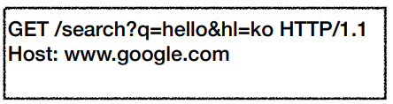
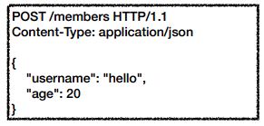

# #4 HTTP 메서드

## HTTP API를 만들어보자
- **요구사항**
    - 회원 정보 관리 API를 만들어라
        - 회원 목록 조회
        - 회원 조회
        - 회원 등록
        - 회원 수정
        - 회원 삭제

- **API URI 설계 **
    - 회원 목록 조회 /read-member-list
    - 회원 조회 /read-member-by-id
    - 회원 등록 /create-member
    - 회원 수정 /update-member
    - 회원 삭제 /delete-member

  
**이것은 좋은 URI 설계일까?**
  
>가장 중요한 것은 **리소스 식별**
  

- **API URI 고민**
    - 리소스의 의미는 뭘까?
        - 회원을 등록하고 수정하고 조회하는게 리소스가 아니다!
        - 예) 미네랄을 캐라 -> 미네랄이 리소스
        - **회원이라는 개념 자체가 바로 리소스다.**
    - 리소스를 어떻게 식별하는게 좋을까?
        - 회원을 등록하고 수정하고 조회하는 것을 모두 배제
        - **회원이라는 리소스만 식별하면 된다. -> 회원 리소스를 URI에 매핑**
     
     

- **API URI 설계**
    - **리소스 식별, URI 계층 구조 활용**
      
    - **회원** 목록 조회 /members
    - **회원** 조회 /members/{id} **-> 어떻게 구분하지?**
    - **회원** 등록 /members/{id} **-> 어떻게 구분하지?**
    - **회원** 수정 /members/{id} **-> 어떻게 구분하지?**
    - **회원** 삭제 /members/{id} **-> 어떻게 구분하지?**
     
     
    - 참고: 계층 구조상 상위를 컬렉션으로 보고 복수단어 사용 권장(member -> members)
  

- **리소스와 행위를 분리**
    - 가장 중요한 것은 리소스를 식별하는 것
      
    - **URI는 리소스만 식별!**
    - **리소스**와 해당 리소스를 대상으로 하는 **행위**를 분리
        - 리소스: 회원
        - 행위: 조회, 등록, 삭제, 변경
    - 리소스는 명사, 행위는 동사 (미네랄을 캐라)
    - 행위(메서드)는 어떻게 구분?

  
  
## HTTP 메서드 - GET, POST

- HTTP 메서드 종류
    - 주요 메서드
        - GET: 리소스 조회
        - POST: 요청 데이터 처리, 주로 등록에 사용
        - PUT: 리소스를 대체, 해당 리소스가 없으면 생성
        - PATCH: 리소스 부분 변경
        - DELETE: 리소스 삭제
    - 기타 메서드
        - HEAD: GET과 동일하지만 메세지 부분을 제외하고, 상태 줄과 헤더만 반환
        - OPTIONS: 대상 리소스에 대한 통신 가능 옵션(메서드)을 설명(주로 CORS에서 사용)
        - CONNECT: 대상 리소스로 식별되는 서버에 대한 터널을 설정
        - TRACE: 대상 리소스에 대한 경로를 따라 메세지 루프백 테스트를 수행
  

- GET
     
    - 리소스 조회
        1. 메세지 전달 
        
        2. 서버 도착 
        
        3. 응답 데이터 
        
    - 서버에 전달하고 싶은 데이터는 query(쿼리 파라미터, 쿼리 스트링)를 통해서 전달
    - 메세지 바디를 사용해서 데이터를 전달할 수 있지만, 지원하지 않는 곳이 많아서 권장하지 않음
  

- POST
     
    - 요청 데이터 처리
        1. 메세지 전달 
        
        2. 신규 리소스 생성 
        
        3. 응답 데이터 
          
    - **메시지 바디를 통해 서버로 요청 데이터 전달**
    - 서버는 요청 데이터를 **처리**
        - 메세지 바디를 통해 들어온 데이터를 처리하는 모든 기능을 수행한다.
    - 주로 전달된 데이터로 신규 리소스 등록, 프로세스 처리에 사용
      
    - **요청 데이터를 어떻게 처리한다는 뜻일까? 예시**
        - 스펙: POST 메서드는 **대상 리소스가 리소스의 고유한 의미 체계에 따라 요청에 포함된 표현을 처리하도록 요청**한다.(구글번역)
        - 예를 들어 POST는 다음과 같은 기능에 사용된다.
            - HTML 양식에 입력된 필드와 같은 데이터 블록을 데이터 처리 프로세스에 제공
                - 예) HTML FORM에 입력한 정보로 회원가입, 주문 등에서 사용  
            - 게시판, 뉴스 그룹, 메일링 리스트, 블로그 또는 유사한 기사 그룹에 메세지 게시
                - 예) 게시판 글쓰기, 댓글 달기  
            - 서버가 아직 식별하지 않은 새 리소스 생성
                - 예) 신규 주문 생성  
            - 기존 자원에 데이터 추가
                - 예) 한 문서 끝에 내용 추가  
        - **정리: 이 리소스 URI에 POST 요청이 오면 요청 데이터를 어떻게 처리할지 리소스마다 따로 정해야 함 -> 정해진 것이 없음**
      
      
    - **정리**
        1. **새 리소스 생성(등록)**
            - 서버가 아직 식별하지 않은 새 리소스 생성  
        2. **요청 데이터 처리**
            - 단순히 데이터를 생성하거나, 변경하는 것을 넘어서 프로세스를 처리해야 하는 경우
                - 예) 주문에서 결제완료 -> 배달시작 -> 배달완료 처럼 단순히 값 변경을 넘어 프로세스의 상태가 변경되는 경우
            - POST의 결과로 새로운 리소스가 생성되지 않을 수도 있음
                - 예) POST /orders/{orderId}/start-delivery (**컨트롤 URI**)  
        3. **다른 메서드로 처리하기 애매한 경우**
            - 예) JSON으로 조회 데이터를 넘겨야 하는데, GET 메서드를 사용하기 어려운 경우
            - 애매하면 POST

  
  
## HTTP 메서드 - PUT, PATCH, DELETE

  
  
## HTTP 메서드의 속성

  
  