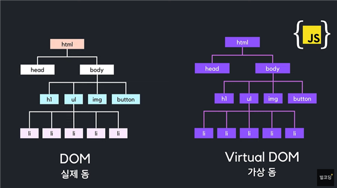
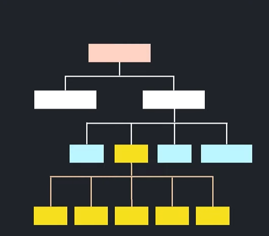
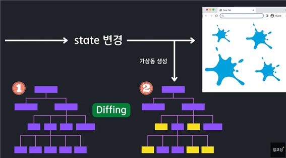

## Virtual DOM에 대한 고찰

# `DOM 이란?`
**Document Object Model의 약자**

DOM은 html elements를 트리 구조로 표현한 것이다.

개발자들은 DOM이 제공하는 api를 통해 dom 구조에 접글을 해서 원하는 element의 구조, 내용, 스타일 들을 조작할 수 있다.

js에서는 getElementById 같은 방법으로 함

# `Virtual DOM 이란?`

**실제 dom을 조작하는 일을 빠르게 해주는 역할을 수행**

복사본은 실제 dom이 아닌 js 객체형태로 메모리 안에 저장되어 있음   
실제 dom 안에 있는 모든 element와 속성을 다 가지고 있음

근데 실제 browser에는 접근을 할 수가 없음

실제 dom을 조작해서 동적으로 움직이는 페이지를 구성하려면 

브라우저가 현재 페이지의 html을 탐색해서 해당 element를 찾고
해당 element와 자녀 element들을 dom에서 제거
그리고 새로 생긴 elemt들로 교체를 함

그리고 css를 재계산 하고, 레이아웃 정보를 알맞게 수정하고 새롭게 계산 된 내용에 따라 브라우저를 랜더링하는 과정을 수행함

이렇게 DOM을 건들면서 화면의 UI를 생성해주는 것은 상당히 비효율적임

하지만,
# `Virtual DOM은 다르다!`

리액트는 항상 두 개의 가상 돔을 가지고 있음

*1번은 초기 dom 정보*   
*2번은 랜더링을 진행하기 직전의 바뀐 dom 정보*

리액트에서 STATE가 변경되면 화면을 랜더링 하는데
새로운 화면을 랜더링 할 2번 DOM을 랜더링 이전 초기 값을 가지고 있는 1번 DOM과 비교를 해서 바뀐 부분만 수정하게 됨

diffing 이라는 기술로 두 dom의 비교를 수행해서 어느 element가 달라졌는지 빠르게 찾아냄
바뀐 부분들만 실제 브라우저 화면에 적용해 주는게 Reconciliation임(재조정)

batch update : 집단 변경이라는 뜻으로 변경된 element들을 한 번에 업데이트 해줌(성능 이슈)
